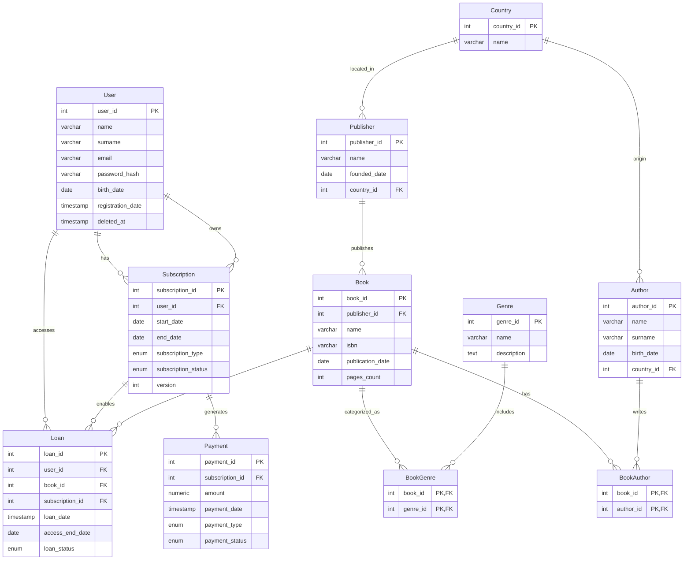

# Документація схеми бази даних

## Діаграма сутність-зв'язок (ERD)

---

## Опис таблиць

### Таблиця: `User`

**Призначення:** Зберігає облікові та персональні дані користувачів онлайн-бібліотеки.

| Стовпець            | Тип          | Обмеження           | Опис                                 |
| ------------------- | ------------ | ------------------- | ------------------------------------ |
| `user_id`           | INT          | PRIMARY KEY, SERIAL | Унікальний ідентифікатор користувача |
| `name`              | VARCHAR(100) | NOT NULL            | Імʼя користувача                     |
| `surname`           | VARCHAR(100) | NOT NULL            | Прізвище користувача                 |
| `email`             | VARCHAR(150) | UNIQUE, NOT NULL    | Email для входу                      |
| `password_hash`     | VARCHAR(255) | NOT NULL            | Хеш пароля                           |
| `birth_date`        | DATE         | NULL                | Дата народження                      |
| `registration_date` | TIMESTAMP    | DEFAULT NOW()       | Дата реєстрації                      |
| `deleted_at`        | TIMESTAMP    | NULL                | Мітка soft delete                    |

**Індекси:**

* Унікальний індекс на `email`
* Композитний індекс `(surname, name)`

**Звʼязки:**

* Один-до-багатьох з `Subscription`
* Один-до-багатьох з `Loan`

---

### Таблиця: `Subscription`

**Призначення:** Облік підписок користувачів.

| Стовпець          | Тип  | Обмеження           | Опис                                |
| ----------------- | ---- | ------------------- | ----------------------------------- |
| `subscription_id` | INT  | PRIMARY KEY, SERIAL | Ідентифікатор підписки              |
| `user_id`         | INT  | FOREIGN KEY         | Користувач                          |
| `start_date`      | DATE | NOT NULL            | Початок дії                         |
| `end_date`        | DATE | NOT NULL            | Кінець дії                          |
| `type`            | ENUM | NOT NULL            | Тип (TRIAL, STANDARD, PREMIUM)      |
| `status`          | ENUM | NOT NULL            | Статус (ACTIVE, EXPIRED, CANCELLED) |
| `version`         | INT  | DEFAULT 0           | Версія для optimistic locking       |

**Індекси:**

* `(user_id, status)`

**Звʼязки:**

* Багато-до-одного з `User`
* Один-до-багатьох з `Payment`
* Один-до-багатьох з `Loan`

---

### Таблиця: `Payment`

**Призначення:** Зберігає інформацію про платежі за підписки.

| Стовпець          | Тип          | Обмеження           | Опис                  |
| ----------------- | ------------ | ------------------- | --------------------- |
| `payment_id`      | INT          | PRIMARY KEY, SERIAL | Ідентифікатор платежу |
| `subscription_id` | INT          | FOREIGN KEY         | Підписка              |
| `amount`          | NUMERIC(8,2) | CHECK ≥ 0           | Сума платежу          |
| `payment_date`    | TIMESTAMP    | DEFAULT NOW()       | Дата платежу          |
| `payment_type`    | ENUM         | NOT NULL            | Тип оплати            |
| `status`          | ENUM         | NOT NULL            | Статус платежу        |

**Звʼязки:**

* Багато-до-одного з `Subscription`

---

### Таблиця: `Loan`

**Призначення:** Облік доступу користувачів до книг.

| Стовпець          | Тип       | Обмеження           | Опис                        |
| ----------------- | --------- | ------------------- | --------------------------- |
| `loan_id`         | INT       | PRIMARY KEY, SERIAL | Ідентифікатор доступу       |
| `user_id`         | INT       | FOREIGN KEY         | Користувач                  |
| `book_id`         | INT       | FOREIGN KEY         | Книга                       |
| `subscription_id` | INT       | FOREIGN KEY         | Підписка                    |
| `loan_date`       | TIMESTAMP | DEFAULT NOW()       | Дата видачі                 |
| `access_end_date` | DATE      | NULL                | Кінець доступу              |
| `status`          | ENUM      | NOT NULL            | ACTIVE / RETURNED / EXPIRED |

**Індекси:**

* `(user_id, status)`

**Звʼязки:**

* Багато-до-одного з `User`
* Багато-до-одного з `Book`
* Багато-до-одного з `Subscription`

---

### Таблиця: `Book`

**Призначення:** Основний каталог книг.

| Стовпець           | Тип          | Обмеження           | Опис               |
| ------------------ | ------------ | ------------------- | ------------------ |
| `book_id`          | INT          | PRIMARY KEY, SERIAL | ID книги           |
| `publisher_id`     | INT          | FOREIGN KEY         | Видавець           |
| `name`             | VARCHAR(200) | NOT NULL            | Назва книги        |
| `isbn`             | VARCHAR(20)  | UNIQUE, NOT NULL    | ISBN               |
| `publication_date` | DATE         | NULL                | Дата публікації    |
| `pages_count`      | INT          | CHECK > 0           | Кількість сторінок |

**Індекси:**

* Унікальний індекс на `isbn`
* Індекс на `name`

**Звʼязки:**

* Багато-до-одного з `Publisher`
* Багато-до-багатьох з `Author` (через `BookAuthor`)
* Багато-до-багатьох з `Genre` (через `BookGenre`)
* Один-до-багатьох з `Loan`

---

### Таблиця: `Author`

**Призначення:** Довідник авторів.

| Стовпець     | Тип          | Обмеження           | Опис            |
| ------------ | ------------ | ------------------- | --------------- |
| `author_id`  | INT          | PRIMARY KEY, SERIAL | ID автора       |
| `name`       | VARCHAR(100) | NOT NULL            | Імʼя            |
| `surname`    | VARCHAR(100) | NOT NULL            | Прізвище        |
| `birth_date` | DATE         | NULL                | Дата народження |
| `country_id` | INT          | FOREIGN KEY         | Країна          |

**Індекси:**

* Індекс на `surname`

---

### Таблиця: `Genre`

**Призначення:** Жанри книг.

| Стовпець      | Тип          | Обмеження           | Опис     |
| ------------- | ------------ | ------------------- | -------- |
| `genre_id`    | INT          | PRIMARY KEY, SERIAL | ID жанру |
| `name`        | VARCHAR(100) | UNIQUE              | Назва    |
| `description` | TEXT         | NULL                | Опис     |

---

### Таблиця: `Publisher`

**Призначення:** Довідник видавців.

| Стовпець       | Тип          | Обмеження           | Опис            |
| -------------- | ------------ | ------------------- | --------------- |
| `publisher_id` | INT          | PRIMARY KEY, SERIAL | ID видавця      |
| `name`         | VARCHAR(150) | NOT NULL            | Назва           |
| `founded_date` | DATE         | NULL                | Дата заснування |
| `country_id`   | INT          | FOREIGN KEY         | Країна          |

---

### Таблиця: `Country`

**Призначення:** Довідник країн.

| Стовпець     | Тип          | Обмеження           | Опис         |
| ------------ | ------------ | ------------------- | ------------ |
| `country_id` | INT          | PRIMARY KEY, SERIAL | ID країни    |
| `name`       | VARCHAR(100) | UNIQUE              | Назва країни |

---

### Допоміжні таблиці

#### `BookAuthor`

* Реалізує звʼязок M:N між книгами та авторами
* Первинний ключ: `(book_id, author_id)`

#### `BookGenre`

* Реалізує звʼязок M:N між книгами та жанрами
* Первинний ключ: `(book_id, genre_id)`

---

## Рішення щодо дизайну

### 1. Обґрунтування структури

Схема орієнтована на реляційну модель з чіткою референтною цілісністю. PostgreSQL обраний через підтримку ENUM, CHECK-обмежень та транзакційності (ACID).

### 2. Нормалізація

База даних відповідає **3 нормальній формі (3NF)**:

* Відсутні транзитивні залежності
* Всі атрибути залежать тільки від PK
* Дані винесені в довідники

### 3. Компроміси

* Soft delete для `User`
* Явні таблиці звʼязків M:N
* ENUM-и замість довідникових таблиць для статусів

### 4. Стратегія індексування

Індекси створені для:

* Частих фільтрацій (`status`, `user_id`)
* Пошуку (`email`, `isbn`, `name`)
* Оптимізації JOIN-операцій
